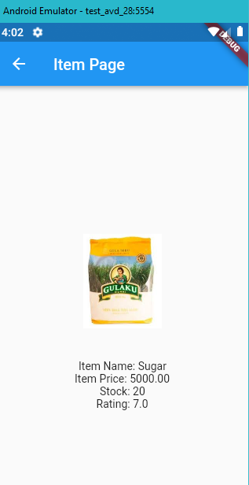

  <h3 align="center">PEMROGRAMAN MOBILE</h3>
  <h3 align="center">UTS</h3>
  

  <h3 align="center">Abiyasa Putra Prasetya</h3>
  <h3 align="center">3G - D4TI</h3>
  <h3 align="center">01</h3>
  <h3 align="center">2141720203</h3>

# Praktikum 5: Membangun Navigasi di Flutter

Tampilan akhir yang akan Anda buat

  

Pada praktikum 5 ini anda akan belajar mengenai pembangunan aplikasi bergerak multi halaman. Aplikasi yang dikembangkan berupa kasus daftar barang belanja. Pada aplikasi ini anda akan belajar untuk berpindah halaman dan mengirimkan data ke halaman lainnya. Gambaran mockup hasil akhir aplikasi dapat anda lihat pada gambar di atas (mockup dibuat sederhana, sehingga Anda mempunyai banyak ruang untuk berkreasi). Desain aplikasi menampilkan sebuah ListView widget yang datanya bersumber dari List. Ketika item ditekan, data akan dikirimkan ke halaman berikutnya.

<h3>Langkah 1: Siapkan project baru<h3>

Sebelum melanjutkan praktikum, buatlah sebuah project baru Flutter dengan nama belanja dan susunan folder seperti pada gambar berikut. Penyusunan ini dimaksudkan untuk mengorganisasi kode dan widget yang lebih mudah.

  

<h3>Langkah 2: Mendefinisikan Route<h3>

Buatlah dua buah file dart dengan nama home_page.dart dan item_page.dart pada folder pages. Untuk masing-masing file, deklarasikan class HomePage pada file home_page.dart dan ItemPage pada item_page.dart. Turunkan class dari StatelessWidget. Gambaran potongan kode dapat anda lihat sebagai berikut.

  

<h3>Langkah 3: Lengkapi Kode di main.dart<h3>

Setelah kedua halaman telah dibuat dan didefinisikan, bukalah file main.dart. Pada langkah ini anda akan mendefinisikan Route untuk kedua halaman tersebut. Definisi penamaan route harus bersifat unique. Halaman HomePage didefinisikan sebagai /. Dan halaman ItemPage didefinisikan sebagai /item. Untuk mendefinisikan halaman awal, anda dapat menggunakan named argument initialRoute. Gambaran tahapan ini, dapat anda lihat pada potongan kode berikut.

  

<h3>Langkah 4: Membuat data model<h3>

Sebelum melakukan perpindahan halaman dari HomePage ke ItemPage, dibutuhkan proses pemodelan data. Pada desain mockup, dibutuhkan dua informasi yaitu nama dan harga. Untuk menangani hal ini, buatlah sebuah file dengan nama item.dart dan letakkan pada folder models. Pada file ini didefinisikan pemodelan data yang dibutuhkan. Ilustrasi kode yang dibutuhkan, dapat anda lihat pada potongan kode berikut.

  

<h3>Langkah 5: Lengkapi kode di class HomePage<h3>

Pada halaman HomePage terdapat ListView widget. Sumber data ListView diambil dari model List dari object Item. Gambaran kode yang dibutuhkan untuk melakukan definisi model dapat anda lihat sebagai berikut.

  

<h3>Langkah 6: Membuat ListView dan itemBuilder<h3>

Untuk menampilkan ListView pada praktikum ini digunakan itemBuilder. Data diambil dari definisi model yang telah dibuat sebelumnya. Untuk menunjukkan batas data satu dan berikutnya digunakan widget Card. Kode yang telah umum pada bagian ini tidak ditampilkan. Gambaran kode yang dibutuhkan dapat anda lihat sebagai berikut.

  

  

Output:

  

<h3>Langkah 7: Menambahkan aksi pada ListView<h3>

Item pada ListView saat ini ketika ditekan masih belum memberikan aksi tertentu. Untuk menambahkan aksi pada ListView dapat digunakan widget InkWell atau GestureDetector. Perbedaan utamanya InkWell merupakan material widget yang memberikan efek ketika ditekan. Sedangkan GestureDetector bersifat umum dan bisa juga digunakan untuk gesture lain selain sentuhan. Pada praktikum ini akan digunakan widget InkWell.

Untuk menambahkan sentuhan, letakkan cursor pada widget pembuka Card. Kemudian gunakan shortcut quick fix dari VSCode (Ctrl + . pada Windows atau Cmd + . pada MacOS). Sorot menu wrap with widget... Ubah nilai widget menjadi InkWell serta tambahkan named argument onTap yang berisi fungsi untuk berpindah ke halaman ItemPage. Ilustrasi potongan kode dapat anda lihat pada potongan berikut.

  

# Tugas Praktikum 2

1. Untuk melakukan pengiriman data ke halaman berikutnya, cukup menambahkan informasi arguments pada penggunaan Navigator. Perbarui kode pada bagian Navigator menjadi seperti berikut.

  

2. Pembacaan nilai yang dikirimkan pada halaman sebelumnya dapat dilakukan menggunakan ModalRoute. Tambahkan kode berikut pada blok fungsi build dalam halaman ItemPage. Setelah nilai didapatkan, anda dapat menggunakannya seperti penggunaan variabel pada umumnya.

  

3. Pada hasil akhir dari aplikasi belanja yang telah anda selesaikan, tambahkan atribut foto produk, stok, dan rating. Ubahlah tampilan menjadi GridView seperti di aplikasi marketplace pada umumnya.

  

  

Output:

  

Isi Grid View:

  

4. Silakan implementasikan Hero widget pada aplikasi belanja Anda dengan mempelajari dari sumber ini: https://docs.flutter.dev/cookbook/navigation/hero-animations

  

5. Sesuaikan dan modifikasi tampilan sehingga menjadi aplikasi yang menarik. Selain itu, pecah widget menjadi kode yang lebih kecil. Tambahkan Nama dan NIM di footer aplikasi belanja Anda.

Home Page:

  

  

Output:

  

Item Page:

  

  

  

